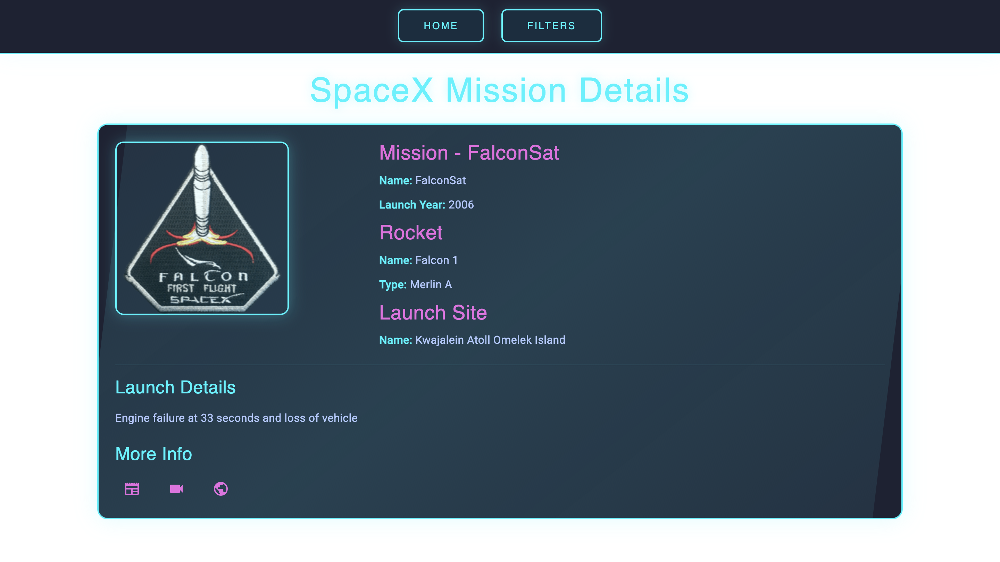

# Lab Test Two - COMP3133

## Screenshots

  
  

Explore the [Live Demo](https://anthony-labtest2.vercel.app/) by clicking the button below:

<a href="https://anthony-labtest.vercel.app/" target="_blank">
  <button>Live Demo</button>
</a>

---

## Project Summary

This Angular-based application presents SpaceX launch data through an intuitive interface. It connects to the SpaceX REST API to display essential details such as:

- **Flight Number**
- **Mission Name**
- **Launch Year**
- **Mission Description**
- **Mission Patch (small image)**
- **Rocket Details:** (including Name and Type)
- **External Links:** to articles, Wikipedia, and videos

The app enables users to narrow down the list of missions by filtering according to the launch year and to access detailed information for any selected mission.

---

## Key Functionalities

- **Mission Overview:** Lists all SpaceX launches with vital details.
- **Year-Based Filtering:** Users can filter missions by the year they were launched.
- **Detailed Mission View:** Offers an expanded view with comprehensive mission details.
- **API Data Management:** Utilizes a dedicated Angular service to fetch and manage data from the SpaceX REST API.
- **Structured Data:** Implements interfaces/classes to define the structure of the data.
- **Modern Responsive Design:** Built using Angular Material components to ensure a sleek and responsive user interface.

---

## Application Architecture

- **Components:**
  - **`missionlist`:** Displays the list of SpaceX launches.
  - **`missionfilter`:** Provides functionality to filter missions based on launch year.
  - **`missiondetails`:** Shows detailed information about a selected mission.
- **Service:**
  - A specialized service manages the fetching and handling of data from the SpaceX REST API.
- **Data Modeling:**
  - Uses interfaces or classes to accurately model the data received from the API.

---

## Hosting

The application is deployed on a live platform. To see it in action, click the **"Live Demo"** button above.
